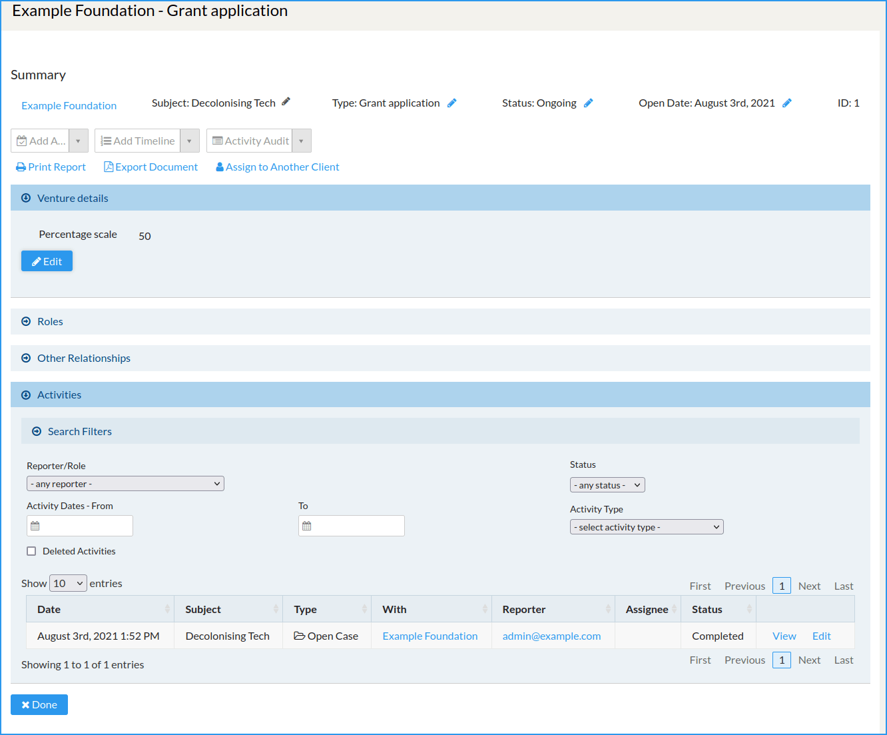
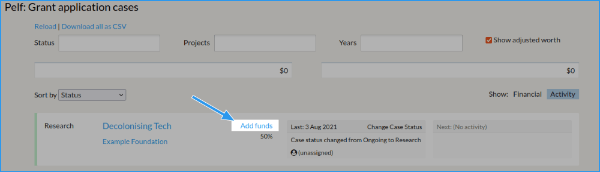
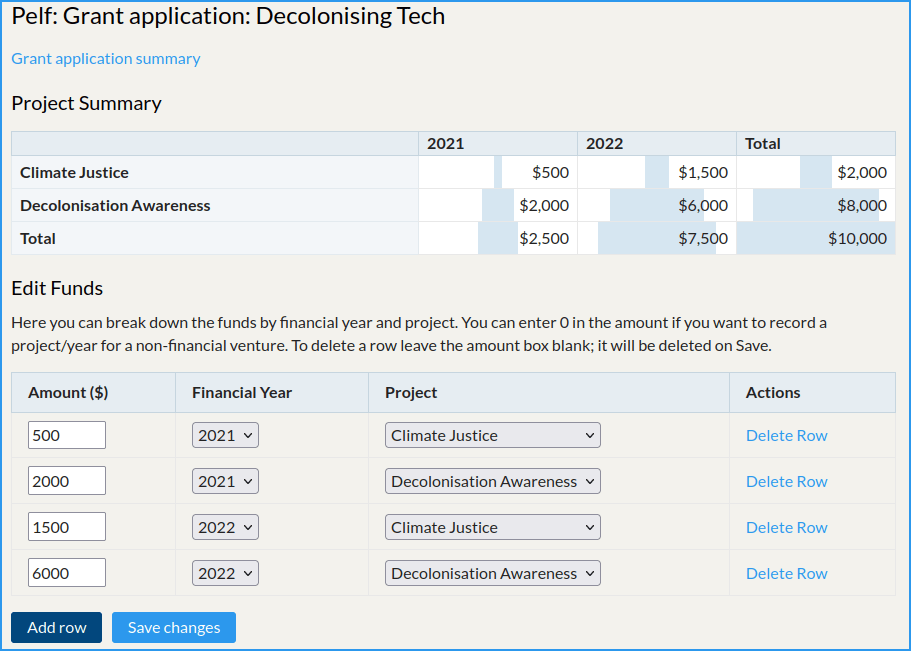
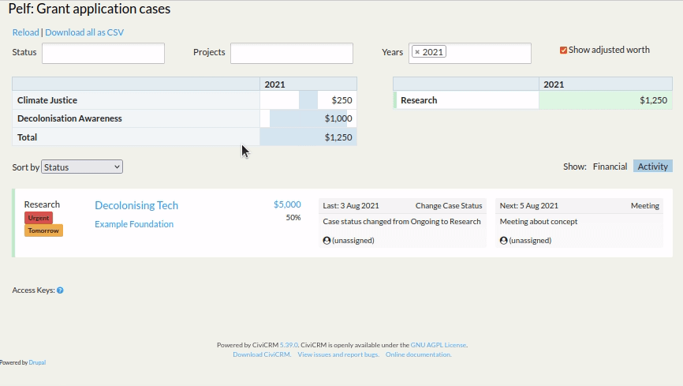
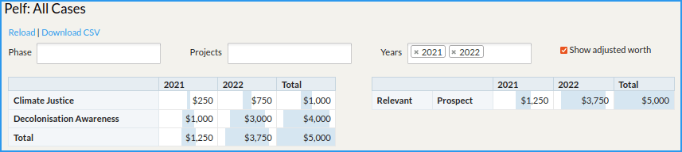

# Tutorial

This tutorial will take you through setting up Pelf to monitor grants that
your organisation applies for.

We’ll set up Pelf for tracking grant applications and then create a made-up
application to *Example Foundation* for a made-up project called *Decolonising
Tech*, to see how it all works.

After the tutorial you can delete all the data, or you can just delete the made
up bits and adjust the rest to suit your needs.

First, [Install Pelf](../howto/install.md).

## Configure Pelf for grant management

Next visit the set-up page at **Administer » CiviCase » Setup Pelf**.

Pelf works with the CiviCase component of CiviCRM so before we can do
anything useful we need a suitable **Case Type**. You can have as many of
these as you like and use them for different types of pipeline processes,
e.g. applying to a grant-giving trust or foundation might typically have
a different process to seeking partnership funding.

This tutorial is focussed on Grant funding applications using a template
provided with Pelf itself. You don't have to use these templates, and **you can
change things later to suit your needs**, but it saves a lot of clicking to use
a template, so we'll do that now.

Scroll down the page to **Templates** and find the section called **Case
Type: Grant application**.

This shows you the statuses (think of case statuses as stages along your
pipeline) that it suggests. Simply click the **Create this case type, and
all required statuses** to set it up - it may take a mo, so be careful not
to click twice.

## Define your organisation’s projects

Pelf allows you to map funds from various funders (or would-be funders) to
different **projects**.

We’ll create a couple of demo projects: *Decolonisation Awareness* and *Climate
Justice*. (You can delete these later.)

Visit **Administer » Customize Data and Screens » Drop-down options**. You'll
see a massive list. Find the one called *Project* (`pelf_project`) and click
**Edit Options**.

This list starts off with one item called **Unallocate**. Leave that be, and
click **Add Project**. Enter the name of the first project and click **Save**,
then repeat for the other project.

!!! success
    Great, we're done with the set-up for this tutorial.

## Add a prospect

Let's say that you're going to apply for £10k funding from *Example Foundation*.

Create a new case:

1. Ensure *Example Foundation* is an organisation in your CRM in the normal way.

2. **Cases » New Case**

3. Client: Choose select *Example Foundation*.

4. Subject: *Decolonising Tech*

5. Case Type: *Grant Application*  
   After selecting this, a new box should appear called **Venture details**.

6. In the Venture details box, enter *50%* in the *Percentage scale*. This is
   how likely you think this particular venture is at this stage. Typically
   organisations might use 10% - 15% for 'cold' applications, and a much higher
   percentage for repeat or warm applications, but it's your call.

7. Click **Save**.

8. Edit the **Status** to **Research**, if it’s not already, and hit Save.

!!! summary
    So far, so good. If you’re familiar with CiviCase this will be very obvious
    to you. All we have done so far is create a Case Type, some Case Statuses
    belonging to that type, and created our first Case, including a single
    custom field (the *Percentage scale*)

### Add funding details for this application.

Visit **Cases » Pelf: Grant application**. This screen will make more sense in a bit. For now, click **Add funds**.

On the screen that appears, click **Add row**.

Let’s say that this project is going to span two of your
financial years, with 25% falling in this financial year (2021, say) and 75% falling in the next year.

Let’s also say that 80% of it funds your *Decolonising Tech* project, and
the other 20% funds your *Climate Justice* project. For this you would enter:

- 500, 2021, Climate Justice
- 2000, 2021, Decolonising Tech
- 1500, 2022, Climate Justice
- 6000, 2022, Decolonising Tech

You should be looking at something like this:

The Project Summary shows the breakdown; the light blue background area is
a centred bar-chart showing the relative amount.

Click **Save**.

### Add a meeting about this application.

Return to the _Case Management_ screen for this application. You can get to this
in any way you like: you can click **Back to Grant application summary** and
click on the application title, or find it from the **Cases » Dashboard**, or
**Search » Cases**, etc.

Use the drop-down to **Add Activity**, choose **Meeting**. This is the standard
CiviCase screen for adding an activity, so fill it in as normal, but put
**tomorrow** in the date, and choose **Urgent** as the priority. Press **Save**.

## Look at the overview for grant applications

Now revisit **Cases » Pelf: Grant application**, which should now look
something like this:

Have a play with the view options and note:

1. The table on the left shows a per-project and financial year breakdown of
   funds. You can see that we have two projects with some funding and how that
   breaks down.

2. The table on the right (or second, if you have a narrow screen) shows
   a breakdown by stage and financial year. We have only entered one prospect,
   at *Research* stage, so that’s not so interesting right now!

3. You can filter the information to show using the drop-downs at the top, e.g.
   to look at certain projects, financial years or maybe to look just at
   prospects or just at secured contracts etc.

4. The amount shown is by default the *adjusted worth*. This is the total (10k)
   × the percentage (50%), so 5k. You can toggle between this view and the
   gross view using the **Show adjusted worth** checkbox.

5. The *Decolonising Tech* prospect flags as Urgent because we set the priority of
   the scheduled meeting as Urgent. You can easily toggle that flag, too. This
   convenience can help when reviewing a list of prospects.

6. The prospect would be one among a list, had you entered more than one.

7. Each prospect shows the latest completed activity on that case, and the next
   scheduled one. You can click those to edit them directly.

8. The *Financial / Activity* toggle for the prospects toggles between showing
   latest/next activities and showing a financial breakdown.

## Look at the organisation wide overview.

The screen at **Cases » Pelf summary** takes all prospects and contracts and
displays them all in one place.

### What’s that *Relevant* category for?

Because each *type* of funding pipeline has its own stages we can’t sensibly
show them all here because we’d be aggregating things that aren’t the same.

For this reason case statuses are grouped into the following categories:

- Relevant
    - Live prospects (e.g. research, application, negotiation, ...)
    - Live contracts (signed, sealed and work is scheduled)
    - Completed contracts

- Irrelevant
    - Dropped ventures - e.g. you decided it was not worth persuing further.
    - Failed (rejected) - they turned you down - the audacity!

Which case statuses belong to which group is configured on the Pelf set-up
screen that you found at the top of this tutorial.

!!! success "Congratulations!"
    You’ve completed the tutorial. Hopefully you now have a reasonable
    understanding of the concepts and screens.
